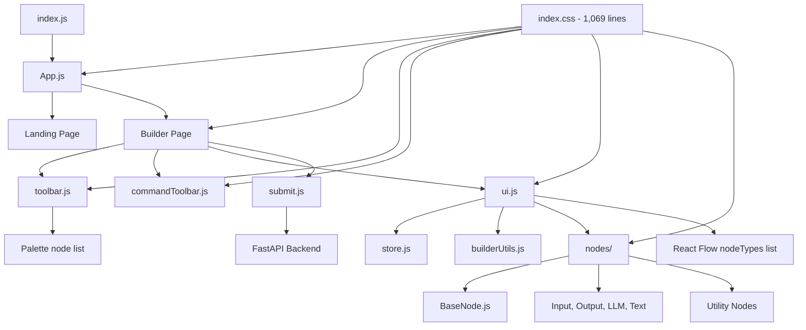
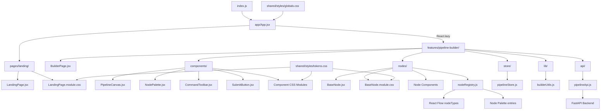
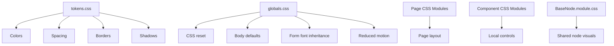
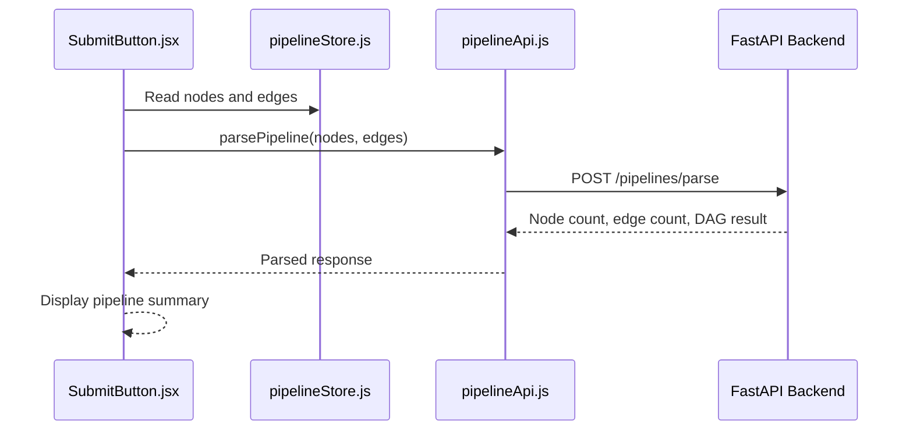

# Pipeline Studio: Architecture Refactor

> A scalability and maintainability refactor of the VectorShift workflow-builder frontend. Existing application behavior is preserved while introducing feature-based organization, CSS Modules, centralized node registration, isolated API access, and route-level code splitting.

---

## Table of Contents

1. [Overview](#overview)
2. [Refactor Goals](#refactor-goals)
3. [Old Architecture](#old-architecture)
4. [Old Architecture Drawbacks](#old-architecture-drawbacks)
5. [New Architecture](#new-architecture)
6. [Architecture Comparison](#architecture-comparison)
7. [Responsibility Map](#responsibility-map)
8. [Why JSX](#why-jsx)
9. [Why CSS Modules](#why-css-modules)
10. [Central Node Registry](#central-node-registry)
11. [Lazy-Loaded Builder](#lazy-loaded-builder)
12. [API and State Separation](#api-and-state-separation)
13. [Performance Impact](#performance-impact)
14. [Behavior Preserved](#behavior-preserved)
15. [Testing](#testing)
16. [Final Outcome](#final-outcome)

---

## Overview

The original implementation completed the required VectorShift assessment tasks successfully.

As the application expanded with:

- An animated landing page
- A separate Builder route
- Nine node types
- Undo and redo
- Duplicate and delete
- Automatic graph layout
- Responsive mobile controls
- Dynamic canvas sizing
- Backend integration

the original flat architecture became increasingly difficult to maintain.

The purpose of this refactor was to improve:

- Scalability
- Maintainability
- File discoverability
- Component ownership
- CSS isolation
- Initial loading performance
- Developer onboarding

The refactor does not intentionally change existing application behavior.

---

## Refactor Goals

| Refactor goal | Implementation |
|---|---|
| Clear component ownership | Feature-based folder structure |
| Prevent CSS conflicts | Component-scoped CSS Modules |
| Reduce initial loading work | Lazy-loaded Builder route |
| Remove duplicate node definitions | Central node registry |
| Separate networking from UI | Dedicated API module |
| Improve file discoverability | `.jsx` for React components |
| Separate calculations from rendering | Pure utility module |
| Preserve application behavior | Existing state and React Flow logic retained |

---

## Old Architecture

### Old Folder Structure

```text
src/
  App.js
  ui.js
  store.js
  toolbar.js
  commandToolbar.js
  draggableNode.js
  submit.js
  builderUtils.js
  index.css
  nodes/
    BaseNode.js
    inputNode.js
    outputNode.js
    llmNode.js
    textNode.js
    utilityNodes.js
```

### Old Architecture Diagram



---

## Old Architecture Drawbacks

### 1. Flat Source Directory

Components, state, utilities, API communication, routing, and Builder logic were located at the same directory level.

```text
src/
  component
  component
  utility
  store
  API logic
  styling
```

As the project grew, it became difficult to determine which files belonged to the landing page and which belonged to the Builder.

### 2. Oversized Application Component

`App.js` contained:

- Routing logic
- Landing-page content
- Builder-page content
- Navigation behavior
- Builder composition

This created multiple responsibilities inside one file.

### 3. Monolithic Global Stylesheet

The application used one global `index.css` file containing approximately 1,069 lines.

Problems included:

- Global selector collisions
- Difficult style ownership
- Difficult dead-style removal
- Higher regression risk
- Landing and Builder styles mixed together

A generic selector such as:

```css
.title {
  font-weight: 700;
}
```

could unintentionally affect multiple unrelated components.

### 4. Weak Feature Boundaries

Builder-related files were distributed across the root `src/` directory.

Removing or extending the Builder required searching through multiple unrelated files.

### 5. Duplicate Node Registration

Node types were maintained in two places:

```text
toolbar.js -> Node Palette configuration
ui.js      -> React Flow nodeTypes configuration
```

Adding a new node required updating both files.

If one location was forgotten, the node could appear in the palette but fail to render, or render without appearing in the palette.

### 6. API Logic Coupled to UI

The Submit component handled:

- Reading Zustand state
- Constructing the request
- Selecting the API URL
- Performing `fetch`
- Checking HTTP status
- Parsing JSON
- Handling errors
- Displaying the result

This mixed network infrastructure with presentation logic.

### 7. Limited Code Splitting

Landing-page and Builder code belonged to the same import path.

Heavy Builder dependencies such as React Flow and Dagre could become part of the initial application loading path.

### 8. Difficult Long-Term Scaling

Adding features such as:

- Pipeline templates
- Validation panels
- Saved workflows
- Builder settings
- Collaboration
- Persistence
- Authentication

would have introduced more unrelated files into the root `src/` directory.

---

## New Architecture

### New Folder Structure

```text
src/
  app/
    App.jsx
    RouteLink.jsx

  pages/
    landing/
      LandingPage.jsx
      LandingPage.module.css

  features/
    pipeline-builder/
      api/
        pipelineApi.js

      components/
        CommandToolbar.jsx
        CommandToolbar.module.css

        NodePalette.jsx
        NodePalette.module.css

        NodePaletteItem.jsx

        PipelineCanvas.jsx
        PipelineCanvas.module.css

        SubmitButton.jsx
        SubmitButton.module.css

      lib/
        builderUtils.js

      nodes/
        BaseNode.jsx
        BaseNode.module.css

        InputNode.jsx
        OutputNode.jsx
        LLMNode.jsx
        TextNode.jsx
        UtilityNodes.jsx

        nodeRegistry.js

      store/
        pipelineStore.js

      BuilderPage.jsx
      BuilderPage.module.css

  shared/
    styles/
      globals.css
      tokens.css

  builderUtils.test.js
  pipelineStore.test.js
  index.js
```

### New Architecture Diagram



---

## Architecture Comparison

| Area | Old architecture | New architecture |
|---|---|---|
| Folder organization | Flat `src/` directory | Feature-based organization |
| Main application | Landing and Builder mixed | Separate page and feature |
| Builder loading | Loaded with application | Lazy-loaded on `/builder` |
| Styling | One global stylesheet | CSS Modules and shared tokens |
| Node registration | Palette and canvas configured separately | One central registry |
| Backend request | Inside Submit component | Dedicated API module |
| Graph calculations | Root utility file | Feature-owned utility module |
| State management | Root-level store | Builder-owned store |
| React components | Mixed `.js` files | Components use `.jsx` |
| Scalability | Increasing root complexity | New features remain grouped |
| CSS safety | Global selectors | Build-time scoped selectors |
| Maintainability | Multiple unclear owners | One owner per responsibility |

---

## Responsibility Map

| Location | Responsibility |
|---|---|
| `app/` | Routing, navigation, Suspense, and route loading |
| `pages/landing/` | Landing-page content and presentation |
| `features/pipeline-builder/` | Complete workflow-builder feature |
| `components/` | Builder controls and React Flow integration |
| `nodes/` | Node abstraction, configurations, and registration |
| `store/` | Nodes, edges, history, and editing commands |
| `lib/` | Placement, dimensions, collision detection, and layout |
| `api/` | Backend URL, HTTP request, and response handling |
| `shared/styles/` | Design tokens and global browser defaults |

---

## Why JSX?

React components were renamed from `.js` to `.jsx`.

### Naming Convention

```text
File renders JSX       -> .jsx
Utility, API, or store -> .js
```

Examples:

```text
BuilderPage.jsx
PipelineCanvas.jsx
BaseNode.jsx
LandingPage.jsx

pipelineApi.js
pipelineStore.js
builderUtils.js
nodeRegistry.js
```

### Benefits

1. React component files are immediately recognizable.
2. Components are visually separated from utilities.
3. Editor syntax highlighting becomes more predictable.
4. Code navigation becomes easier.
5. Code reviews communicate file intent more clearly.
6. New developers can understand the project faster.

### Performance Impact

`.js` and `.jsx` compile into equivalent JavaScript.

Using `.jsx` does not directly improve or reduce React rendering speed.

It is a developer-experience and maintainability decision.

---

## Why CSS Modules?

The original global stylesheet was replaced with component-level CSS Modules.

### Component and Style Ownership

```text
BuilderPage.jsx
BuilderPage.module.css

CommandToolbar.jsx
CommandToolbar.module.css

NodePalette.jsx
NodePalette.module.css

PipelineCanvas.jsx
PipelineCanvas.module.css

SubmitButton.jsx
SubmitButton.module.css

BaseNode.jsx
BaseNode.module.css
```

### CSS Module Example

```jsx
import styles from './CommandToolbar.module.css';

export const CommandToolbar = () => {
  return (
    <div className={styles.toolbar}>
      <button className={styles.button}>
        Undo
      </button>
    </div>
  );
};
```

```css
.toolbar {
  display: flex;
  align-items: center;
  gap: 4px;
}

.button {
  width: 36px;
  height: 36px;
}
```

The build generates locally scoped class names.

Conceptually:

```text
.toolbar
```

becomes something similar to:

```text
CommandToolbar_toolbar__a83f2
```

This prevents another component from accidentally overriding the same class name.

### Benefits

1. Build-time class-name scoping.
2. Protection against selector collisions.
3. Clear component ownership.
4. Easier style removal.
5. Easier responsive maintenance.
6. Lower regression risk.
7. No CSS-in-JS runtime styling engine.
8. Normal browser CSS performance.

---

## Shared Styling Strategy

Not every style should be local.

The application uses a layered styling model.



### `tokens.css`

Contains reusable design values:

```css
:root {
  --color-primary: #2563eb;
  --color-teal: #0f766e;
  --color-text: #0f172a;
  --color-muted: #64748b;
  --color-border: #dbe4f0;
  --radius-card: 8px;
  --shadow-panel: 0 18px 45px rgba(15, 23, 42, 0.12);
}
```

### `globals.css`

Contains only genuinely global rules:

```css
* {
  box-sizing: border-box;
}

body {
  margin: 0;
  font-family: Arial, sans-serif;
}

button,
input,
select,
textarea {
  font: inherit;
}
```

### Node Styling

Individual node components do not require separate CSS files because they intentionally share one design system through:

```text
BaseNode.jsx
BaseNode.module.css
```

This prevents visual duplication across nine node types.

---

## Central Node Registry

`nodeRegistry.js` is the single source of truth for node registration.

### Example

```js
export const nodeRegistry = {
  customInput: {
    component: InputNode,
    label: 'Input',
    variant: 'source',
  },

  llm: {
    component: LLMNode,
    label: 'LLM',
    variant: 'ai',
  },

  customOutput: {
    component: OutputNode,
    label: 'Output',
    variant: 'output',
  },
};
```

React Flow node types are derived from the registry:

```js
export const nodeTypes = Object.fromEntries(
  Object.entries(nodeRegistry).map(
    ([type, configuration]) => [
      type,
      configuration.component,
    ]
  )
);
```

The Node Palette is also derived from the same registry:

```js
export const nodePalette = Object.entries(nodeRegistry).map(
  ([type, configuration]) => ({
    type,
    label: configuration.label,
    variant: configuration.variant,
  })
);
```

### Benefits

1. One source of truth.
2. No palette and canvas duplication.
3. Lower risk when adding nodes.
4. Easier metadata extension.
5. Easier testing.
6. Easier future plugin-style node loading.

---

## Lazy-Loaded Builder

The Builder is loaded using React route-level code splitting.

```jsx
import { lazy, Suspense } from 'react';

const BuilderPage = lazy(
  () => import('../features/pipeline-builder/BuilderPage')
);
```

```jsx
export default function App() {
  const isBuilderRoute = window.location.pathname === '/builder';

  if (isBuilderRoute) {
    return (
      <Suspense fallback={<div>Loading builder...</div>}>
        <BuilderPage />
      </Suspense>
    );
  }

  return <LandingPage />;
}
```

### What Loads Later?

The Builder lazy chunk contains:

- React Flow integration
- Dagre layout logic
- Builder state
- Node components
- Command toolbar
- Node Palette
- Builder CSS
- Submission controls

### Benefit

Users opening only the landing page do not immediately execute Builder-specific code.

This is the primary loading-performance improvement of the refactor.

---

## API and State Separation

### Previous Submit Flow

```text
Submit component
  -> read state
  -> select API URL
  -> perform fetch
  -> check response
  -> parse JSON
  -> display result
```

### Current Submit Flow



### API Module

```js
const API_BASE_URL =
  process.env.REACT_APP_API_URL ||
  'http://localhost:8000';

export async function parsePipeline(nodes, edges) {
  const response = await fetch(
    `${API_BASE_URL}/pipelines/parse`,
    {
      method: 'POST',
      headers: {
        'Content-Type': 'application/json',
      },
      body: JSON.stringify({ nodes, edges }),
    }
  );

  if (!response.ok) {
    throw new Error(
      `Request failed with status ${response.status}`
    );
  }

  return response.json();
}
```

### Benefits

1. Submit UI remains focused on presentation.
2. Backend URL is configured in one place.
3. HTTP errors are handled consistently.
4. API logic can be tested independently.
5. Future authentication can be added centrally.

---

## State Ownership

`pipelineStore.js` owns:

- Nodes
- Edges
- Node IDs
- Node creation
- Connections
- Field updates
- Undo
- Redo
- Delete
- Duplicate
- Auto-layout
- Drag history
- Selection state

React components subscribe only to the state they require.

Example:

```js
const canUndo = usePipelineStore(
  (state) => state.past.length > 0
);

const undo = usePipelineStore(
  (state) => state.undo
);
```

Focused selectors reduce unnecessary component updates and make component dependencies explicit.

---

## Utility Ownership

`builderUtils.js` contains pure graph and layout calculations:

```text
Viewport constants
Zoom limits
Node dimensions
Grid snapping
Collision detection
Available-position search
Dagre auto-layout
```

These functions do not render React UI.

Pure utilities are easier to:

- Unit test
- Reuse
- Debug
- Optimize
- Refactor

---

## Performance Impact

### Changes That Do Not Directly Affect Rendering Speed

The following decisions primarily improve maintainability:

```text
.js -> .jsx
Moving files into folders
CSS Modules
Renaming components
```

### Changes That Improve Application Loading

```text
Lazy-loaded Builder route
Builder-specific JavaScript chunks
Builder-specific CSS chunks
Landing and Builder separation
```

### Changes That Protect Runtime Performance

```text
Focused Zustand selectors
Pure graph utilities
Static node registry
Bounded history
Shared BaseNode abstraction
```

The refactor does not introduce a runtime CSS engine or additional React context layers.

---

## Behavior Preserved

The architecture refactor retains:

- Input node
- Output node
- LLM node
- Text node
- Transform node
- Filter node
- API node
- Branch node
- Merge node
- Shared BaseNode abstraction
- Dynamic Text-node variable handles
- Autosizing Text-node textarea
- React Flow connections
- Smart node placement
- Grid snapping
- Automatic canvas growth
- Dagre auto-layout
- Undo and redo
- Duplicate and delete
- Fit View
- Zoom constraints
- Mobile node drawer
- Pipeline submission
- Backend node counting
- Backend edge counting
- DAG validation

---

## Testing

### Frontend Tests

```powershell
cd frontend
$env:CI='true'
npm.cmd test -- --watchAll=false --runInBand
```

Verified frontend areas:

```text
Viewport limits
Grid snapping
Collision-safe placement
Dagre auto-layout
Undo and redo
Tap-based node creation
Duplicate behavior
Delete behavior
Undo restoration
```

### Production Build

```powershell
cd frontend
npm.cmd run build
```

### Backend Tests

```powershell
cd backend
.\.venv\Scripts\python.exe -m unittest -v
```

Verified backend areas:

```text
Acyclic pipeline detection
Cyclic pipeline detection
Node counting
Edge counting
Response contract
```

### Final Results

```text
Frontend tests:  9 passed
Backend tests:   2 passed
Production build: Passed
API integration: Passed
Desktop QA:       Passed
Mobile QA:        Passed
Console errors:   None
```

---

## Trade-Offs

The new architecture introduces more directories and CSS files.

This creates slightly more navigation for very small changes.

The trade-off is intentional because it provides:

- Stronger ownership
- Lower CSS risk
- Better scalability
- Easier testing
- Easier onboarding
- Better code splitting
- More predictable maintenance

For a single-page prototype, the old structure may be sufficient.

For a growing application with multiple routes and Builder features, the feature-based structure is more appropriate.

---

## Migration Summary

```text
App.js
  -> app/App.jsx
  -> pages/landing/LandingPage.jsx
  -> features/pipeline-builder/BuilderPage.jsx

ui.js
  -> features/pipeline-builder/components/PipelineCanvas.jsx

store.js
  -> features/pipeline-builder/store/pipelineStore.js

toolbar.js
  -> features/pipeline-builder/components/NodePalette.jsx

draggableNode.js
  -> features/pipeline-builder/components/NodePaletteItem.jsx

commandToolbar.js
  -> features/pipeline-builder/components/CommandToolbar.jsx

submit.js
  -> features/pipeline-builder/components/SubmitButton.jsx
  -> features/pipeline-builder/api/pipelineApi.js

builderUtils.js
  -> features/pipeline-builder/lib/builderUtils.js

nodes/
  -> features/pipeline-builder/nodes/

index.css
  -> shared/styles/tokens.css
  -> shared/styles/globals.css
  -> page CSS Modules
  -> component CSS Modules
  -> BaseNode.module.css
```

---

## Final Outcome

The architecture now provides:

- Clear ownership boundaries
- Feature-level isolation
- Scoped component styling
- Centralized node registration
- Isolated backend communication
- Easier testing
- Better route-level code splitting
- Improved developer onboarding
- Lower long-term maintenance risk
- A scalable foundation for future Builder features

> **Same application behavior. Better separation, scalability, maintainability, and testability.**